<!-- ╔══════════════════════════════════════════════════════════════╗ -->
<!--   Glass header banner — host glass-header.svg in your repo root  -->
<!--   (or in an /assets folder) and the path below will render it.   -->
<!-- ╚══════════════════════════════════════════════════════════════╝ -->

 

<!-- Animated typing line -->

  

<!-- Social + counter badges (flat-square reads cleaner against glass) -->

---

## 👋 About Me

I'm a **B.Tech Computer Science** student at **GNITC**, focused on **AI engineering, Salesforce development, and full-stack web**. I like turning theory into things people can actually use — clean Apex on the platform side, and polished, motion-driven interfaces on the front end.

- 🔭 Currently building with **React + Salesforce + the Claude API**
- 🌱 Going deeper on **full-stack** — React, Node.js, PostgreSQL, MongoDB
- 🎨 Obsessed with **glassmorphism, smooth animations, and premium UI/UX**
- 💬 Ask me about **Apex, LWC, DevOps pipelines, or building AI-powered apps**

---

## 🛠️ Tech Stack

**Languages & Core**

**Frontend & Frameworks**

**Data & Platform**

**Salesforce** &nbsp;·&nbsp; **Canva** &nbsp;·&nbsp; **Claude API & Agent Skills**

---

## 📊 GitHub Analytics

 

---

## 🏆 Trophies

---

## 📈 Contribution Graph

---

### 📬 Let's build something

  

<i>Thanks for stopping by — let's explore the fascinating world of technology together. 🚀</i>

<!--
Nayansai/Nayansai is a ✨ special ✨ repository because its README.md
appears on your GitHub profile. Click Preview to see your changes.
-->
